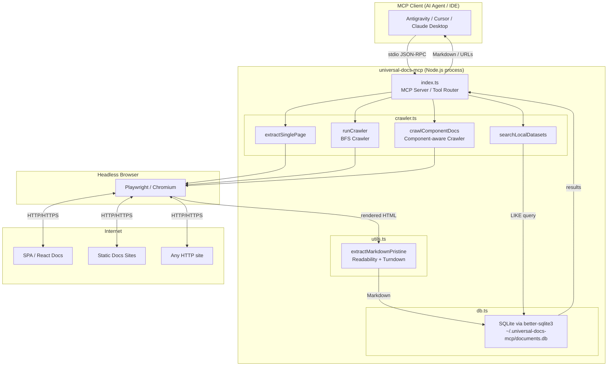
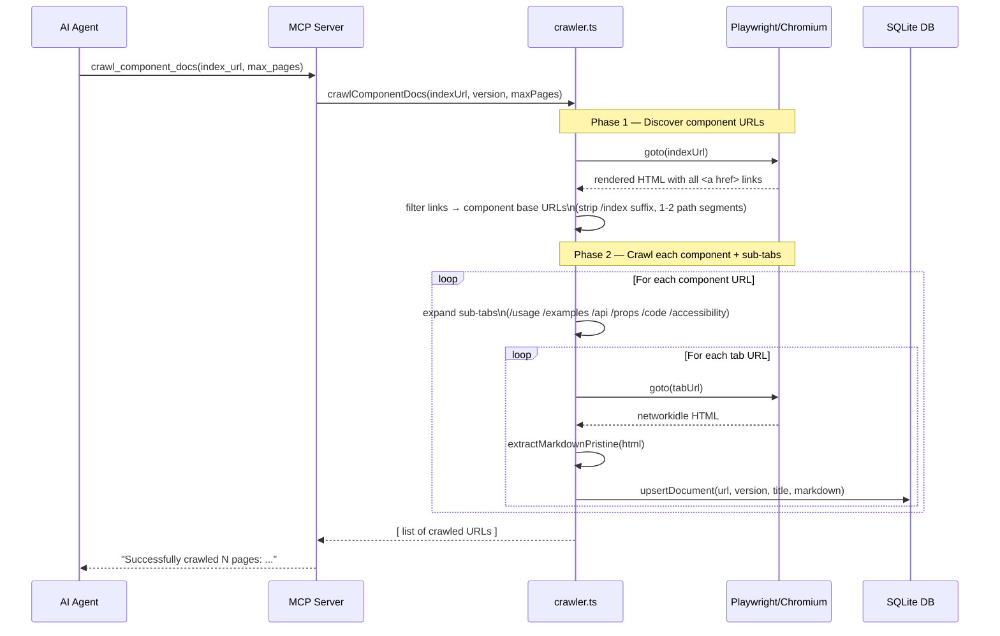
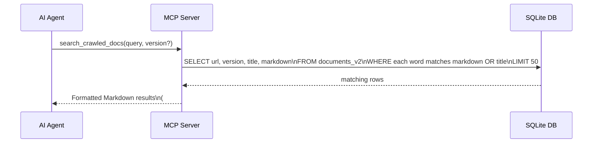
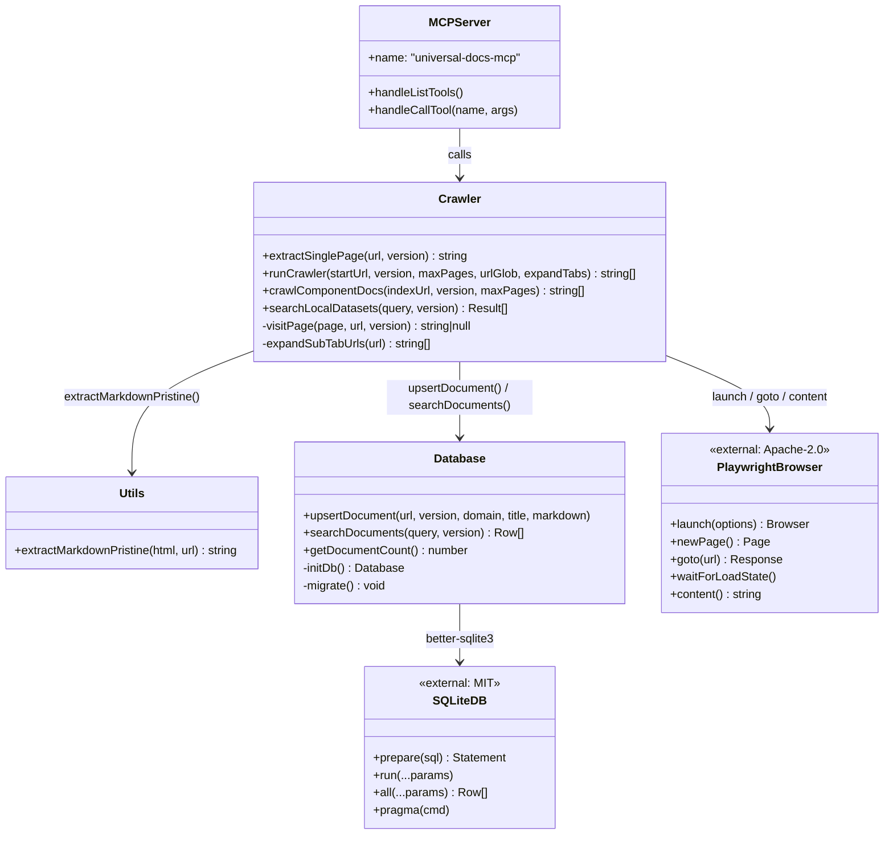
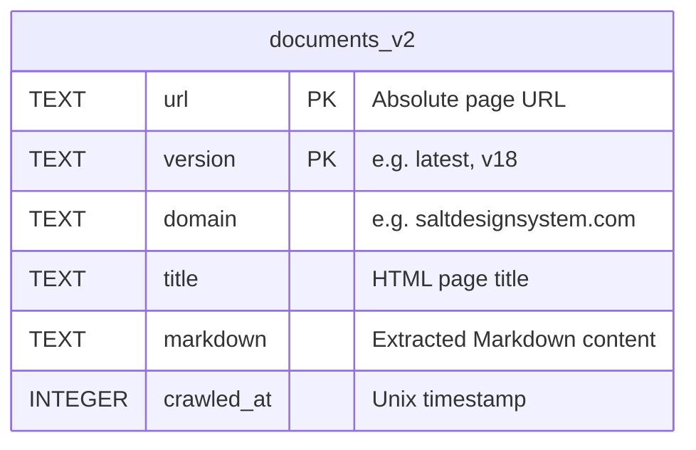

# Universal Docs MCP

> An MCP (Model Context Protocol) server that crawls, extracts, and caches web documentation — including JavaScript-heavy SPAs — into pristine, LLM-ready Markdown stored in a local SQLite database.

[](https://www.npmjs.com/package/@goldprogrammer/http-universal-docs-mcp)
[](LICENSE)

---

## Architecture Overview



---

## Data Flow

### Tool: `crawl_component_docs`



### Tool: `search_crawled_docs`



---

## Component Diagram



---

## Storage Schema



- **Location**: `~/.universal-docs-mcp/documents.db`
- **Engine**: SQLite via `better-sqlite3` (MIT)
- **Primary key**: `(url, version)` — supports versioned docs side-by-side
- **Search**: Per-word `LIKE` with `AND` logic across `markdown` and `title` columns

---

## Installation

No cloning required. Run directly via `npx`:

```bash
# Add to my MCP client config
npx -y @goldprogrammer/http-universal-docs-mcp
```

### MCP Config (`mcp_config.json` / `claude_desktop_config.json`)

```json
{
  "mcpServers": {
    "universal-docs-mcp": {
      "command": "npx",
      "args": ["-y", "@goldprogrammer/http-universal-docs-mcp@latest"]
    }
  }
}
```

> **First run**: Playwright will auto-install Chromium (~200 MB). This happens once via the `postinstall` script.

---

## Available Tools

| Tool | Description |
|---|---|
| `read_and_extract_page` | Visits a single URL, renders JS, extracts main content as Markdown, caches it |
| `crawl_documentation_site` | BFS crawler — follows same-hostname links up to `max_pages` |
| `crawl_component_docs` | Smart component crawler — discovers all components from an index page, crawls each + sub-tabs |
| `search_crawled_docs` | Full-text search across all cached docs — returns matching Markdown pages |

### Tool Parameters

#### `read_and_extract_page`
| Param | Type | Default | Description |
|---|---|---|---|
| `url` | string | required | Page URL to visit and extract |
| `version` | string | `latest` | Version label to store against |

#### `crawl_documentation_site`
| Param | Type | Default | Description |
|---|---|---|---|
| `start_url` | string | required | Root URL to begin crawling from |
| `version` | string | `latest` | Version label |
| `max_pages` | number | `10` | Max pages to crawl |
| `url_glob` | string | — | Path filter (e.g. `/components/`) |
| `expand_tabs` | boolean | `true` | Auto-enqueue sub-tab variants |

#### `crawl_component_docs`
| Param | Type | Default | Description |
|---|---|---|---|
| `index_url` | string | required | Component listing page URL |
| `max_pages` | number | `200` | Max pages to crawl |
| `version` | string | `latest` | Version label |

#### `search_crawled_docs`
| Param | Type | Default | Description |
|---|---|---|---|
| `query` | string | required | Search terms (space-separated; all must match) |
| `version` | string | — | Filter results to a specific version |

---

## Sub-tab Expansion

`crawl_component_docs` and `crawl_documentation_site` (with `expand_tabs=true`) automatically probe these sub-tab URLs for every component discovered:

```
/usage  /examples  /accessibility  /api  /props  /code
```

This makes it work out of the box with:
- **Salt Design System** (`saltdesignsystem.com`)
- **MUI** (`mui.com`)
- **Ant Design** (`ant.design`)
- **Chakra UI** (`chakra-ui.com`)
- Any docs site with tabbed component pages

---

## Dependencies

All production dependencies are **MIT or Apache-2.0** licensed — no GPL code:

| Package | Version | License | Purpose |
|---|---|---|---|
| `playwright` | `^1.58` | Apache-2.0 | Headless Chromium browser for JS rendering |
| `better-sqlite3` | `^12.6` | MIT | Fast synchronous SQLite bindings |
| `jsdom` | `^22.1` | MIT | Server-side DOM for Readability extraction |
| `turndown` | `^7.2` | MIT | HTML → Markdown conversion |
| `turndown-plugin-gfm` | `^1.0` | MIT | GitHub Flavored Markdown tables/strikethrough |
| `@modelcontextprotocol/sdk` | `^1.26` | MIT | MCP server protocol & stdio transport |

> ⚠️ Previous versions (`≤1.1.4`) depended on `crawlee` which transitively included `idcac-playwright` (GPL-3.0). This was **removed in v1.1.5**.

---

## Local Development

```bash
# 1. Clone and install
git clone https://github.com/goldprogrammer/http-crawl-mcp
cd http-crawl-mcp
npm install

# 2. Build TypeScript
npm run build

# 3. Point your MCP client at the local build
# In mcp_config.json:
# { "command": "node", "args": ["/path/to/http-crawl-mcp/build/index.js"] }
```

### Project Structure

```
src/
├── index.ts      # MCP server + tool definitions
├── crawler.ts    # Playwright-based crawlers & search
├── db.ts         # SQLite schema, upsert, search
├── utils.ts      # HTML → Markdown extraction (Readability + Turndown)
└── setup.ts      # Playwright browser install check

build/            # Compiled JS (generated by tsc)
```

---

## License

MIT — see [LICENSE](LICENSE).
