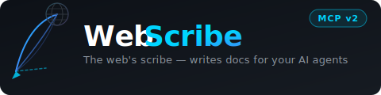

<p align="center">
  
</p>

<h3 align="center">The web's scribe — writes any HTTP documentation into your AI agent's context.</h3>

<p align="center">
  <a href="https://www.npmjs.com/package/webscribe-mcp">
    
  </a>
  <a href="https://nodejs.org">
    
  </a>
  <a href="./LICENSE">
    
  </a>
  
  
  
  <a href="https://github.com/yourname/http-crawl-mcp/actions">
    
  </a>
</p>

---

## What is WebScribe?

**WebScribe** is an MCP server that crawls any public documentation website and makes it instantly searchable by AI agents. Think of it as a scribe sitting between your copilot and the internet — reading docs, understanding their structure, and delivering precise, context-rich answers.

```
Agent asks: "How do I add a loading spinner to an MUI Button?"
                    ↓
WebScribe searches its locally indexed chunks
                    ↓
Returns: {
  heading_path: ["Button", "Loading", "API"],
  content: "Use the `loading` prop on LoadingButton from @mui/lab.
            <LoadingButton loading variant='contained'>Submit</LoadingButton>",
  score: 4.1
}
```

No more hallucinations from outdated training data. No more full-page dumps. Just the right chunk of the right doc, every time.

---

## ✨ Features

| Feature | Description |
|---|---|
| ⚡ **FTS5 Full-Text Search** | SQLite FTS5 with BM25 relevance ranking — not `LIKE %query%` |
| 🧠 **Semantic Chunking** | Splits pages at H1/H2/H3 boundaries with full breadcrumb `heading_path` |
| 🚀 **Concurrent Crawling** | 3 parallel Playwright pages via `p-limit` |
| 🗺️ **Sitemap Discovery** | Auto-fetches `sitemap.xml` before link-following for complete coverage |
| 🤖 **robots.txt Compliance** | Respects allow/disallow + `Crawl-Delay` per domain |
| 🔄 **Smart Re-crawl** | ETag / Last-Modified check — unchanged pages are skipped automatically |
| 🎯 **Site Profiles** | Bundled per-framework CSS extractors (Docusaurus, VitePress, MkDocs, Nextra…) |
| 💻 **Code Language Detection** | Detects `language-*` / `prism-*` / `hljs-*` classes → explicit fenced code blocks |
| 📦 **Structured JSON Output** | Search returns `{ heading_path, content, score }` arrays — not markdown blobs |
| 🔒 **MIT Only** | Zero GPL / LGPL / copyleft dependencies |

---

## 🚀 Quick Start

### Use via npx (recommended)

Add to your MCP client configuration (Claude Desktop, Cursor, VS Code, etc.):

```json
{
  "mcpServers": {
    "webscribe": {
      "command": "npx",
      "args": ["-y", "webscribe-mcp@latest"]
    }
  }
}
```

### Run locally

```bash
git clone https://github.com/yourname/http-crawl-mcp
cd http-crawl-mcp
npm install
npm run dev
```

**Requirements:** Node.js ≥ 18, macOS / Linux / Windows (WSL recommended)

---

## 🛠️ MCP Tools

### `read_and_extract_page`

Visits a single URL, strips navigation/sidebars, and returns clean Markdown with language-tagged code blocks.

```jsonc
// Input
{ "url": "https://cube.dev/docs/product/data-modeling/overview" }
```

---

### `crawl_documentation_site`

BFS crawl from a starting URL. Discovers pages via sitemap.xml first, then link-following.  
Respects `robots.txt`. Skips unchanged pages. Expands sub-tabs automatically.

```jsonc
// Input
{
  "start_url": "https://nextjs.org/docs",
  "max_pages": 50,
  "version": "v15",
  "url_glob": "**/docs/**",
  "expand_tabs": true
}

// Output
{ "crawled_count": 47, "urls": ["https://nextjs.org/docs/...", "..."] }
```

---

### `search_crawled_docs`

BM25-ranked full-text search over all indexed chunks. Returns **structured JSON** with heading breadcrumbs.

```jsonc
// Input
{ "query": "button aria label accessibility" }

// Output
{
  "results": [
    {
      "url": "https://saltdesignsystem.com/salt/components/button/accessibility",
      "title": "Button — Salt Design System",
      "heading_path": ["Button", "Accessibility", "Keyboard Navigation"],
      "content": "The button component supports Space and Enter key activation...",
      "score": 3.82,
      "version": "latest"
    }
  ]
}
```

> **`heading_path`** is the key differentiator — agents get full breadcrumb context so they know exactly where in the docs the answer sits.

---

### `crawl_component_docs`

Two-phase crawler for component library index pages.  
**Phase 1** discovers component links. **Phase 2** crawls each component + sub-tabs (`/usage`, `/examples`, `/api`, `/accessibility`) concurrently.

```jsonc
{ "index_url": "https://saltdesignsystem.com/salt/components/", "max_pages": 200 }
```

Works with Salt DS, MUI, Ant Design, Chakra UI, Radix, and any similar design system.

---

### `get_document`

Retrieves the full cached Markdown for a specific URL. Use when a search chunk needs more surrounding context.

```jsonc
{ "url": "https://nextjs.org/docs/routing/introduction", "version": "v15" }
```

---

### `get_index_stats`

Returns the total pages and semantic chunks in the local index.

```jsonc
// Output
{ "total_pages": 142, "total_chunks": 891 }
```

---

## ⚙️ Architecture

```
┌─────────────────────────────────────────────────────────┐
│         MCP Client (Cursor · Claude Desktop · Copilot)  │
└────────────────────────┬────────────────────────────────┘
                         │  JSON-RPC / stdio
┌────────────────────────▼────────────────────────────────┐
│               WebScribe  MCP Server                     │
│                   src/index.ts                          │
└──────┬──────────────────────────┬───────────────────────┘
       │                          │
┌──────▼──────────┐    ┌──────────▼──────────────────────┐
│  crawler.ts     │    │  db.ts  (SQLite WAL)             │
│                 │    │                                  │
│  sitemap.ts     │    │  documents_v2  url·version·etag  │
│  robots.ts      │    │  chunks        heading_path·text │
│  profiles.ts    │    │  chunks_fts    FTS5 BM25 index   │
│  chunker.ts     │    └──────────────────────────────────┘
│  utils.ts       │
└─────────────────┘
```

### Crawl pipeline

| Step | What happens |
|---|---|
| **① Sitemap** | Fetch `/sitemap.xml` — handles `sitemapindex` recursion, seeds the full URL queue |
| **② robots.txt** | Parse once per domain, cache in-memory, skip disallowed URLs |
| **③ ETag check** | HEAD request — skip pages whose `ETag`/`Last-Modified` hasn't changed |
| **④ Playwright** | Full SPA render + reveal hidden content (show-code buttons, accordions) |
| **⑤ Profile match** | Framework-specific CSS selectors (or generic `<main>` fallback) |
| **⑥ Noise removal** | Strip nav, sidebar, footer, cookie banners, ads |
| **⑦ Markdown** | Turndown + GFM + explicit code language tags |
| **⑧ Chunking** | Split at H1/H2/H3 → `{ heading_path: [...], content: "..." }` |
| **⑨ Persist** | Full doc + chunks stored; FTS5 index updated via SQLite triggers |

---

## 🎯 Supported Frameworks

| Profile | Matched Sites |
|---|---|
| **Docusaurus** | React, any Docusaurus v2/v3 site |
| **VitePress** | Vue.js docs, Vite, Vitest |
| **MkDocs Material** | FastAPI, Django, Python ecosystem |
| **Nextra** | Vercel docs, SWR, Next.js |
| **ReadTheDocs / Sphinx** | Python, ReadTheDocs.io |
| **Cube.dev** | cube.dev/docs |
| **Stripe** | stripe.com/docs |
| **Generic** | Everything else — semantic `<main>` / `[role="main"]` |

---

## 💾 Storage

Data is stored in **`~/.universal-docs-mcp/documents.db`** — survives `npx` package updates.

```
~/.universal-docs-mcp/documents.db
├── documents_v2   — full page markdown per (url, version), with etag cache headers
├── chunks         — heading-based sections with JSON heading_path breadcrumb
└── chunks_fts     — FTS5 virtual table powering BM25 search  
```

Multiple doc versions coexist: crawl with `version: "v14"` and `version: "v15"` — they live side by side.

---

## 🧪 Tests

```bash
# Unit tests — no browser, ~5 seconds
npm run test:unit

# Live integration test — Playwright crawl of cube.dev
npm run test:integration

# Full suite
npm test
```

| Test file | Tests | What it covers |
|---|---|---|
| `tests/chunker.test.ts` | 5 | Heading splitting, breadcrumbs, preamble, stack reset, edge cases |
| `tests/robots.test.ts` | 3 | Live allow/disallow (example.com, httpbin.org), cache re-use |
| `tests/sitemap.test.ts` | 3 | Missing sitemap fallback, live parse (1044 URLs from cube.dev), path filter |
| `tests/db.test.ts` | 5 | FTS5 insert+search, BM25 ranking, ETag cache, empty result |
| `tests/integration.test.ts` | 6 | End-to-end: crawl → chunk → FTS5 search (live against cube.dev) |

**Smoke tests** (manual/interactive):

```bash
npm run smoke:extraction    # Single page extract on example.com
npm run smoke:crawler       # BFS crawler on turndown.js.org
npm run smoke:card          # Salt DS Card component extraction
npm run smoke:mcp-client    # All 6 MCP tools via stdio
npm run smoke:mcp-crawl     # Full crawl + search flow via MCP
```

---

## 📦 Dependencies

All runtime dependencies are **MIT licensed** — no GPL, LGPL, or copyleft.

| Package | Purpose | License |
|---|---|---|
| `@modelcontextprotocol/sdk` | MCP server protocol | MIT |
| `playwright` | Headless Chromium SPA rendering | Apache-2.0 ¹ |
| `better-sqlite3` | SQLite + FTS5 storage | MIT |
| `jsdom` | HTML DOM parsing | MIT |
| `turndown` + `turndown-plugin-gfm` | HTML → Markdown + GFM tables | MIT |
| `p-limit` | Concurrency pool | MIT |
| `robots-parser` | robots.txt parsing & compliance | MIT |

> ¹ Apache-2.0 is permissive (not copyleft). The Chromium binary uses the BSD-style Chromium license.

---

## 📄 License

[MIT](./LICENSE) © Rohit
